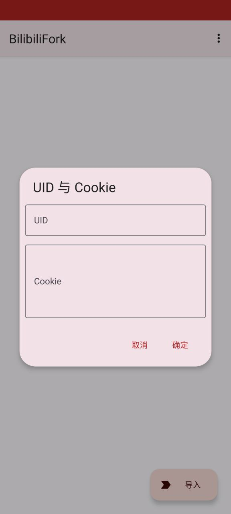
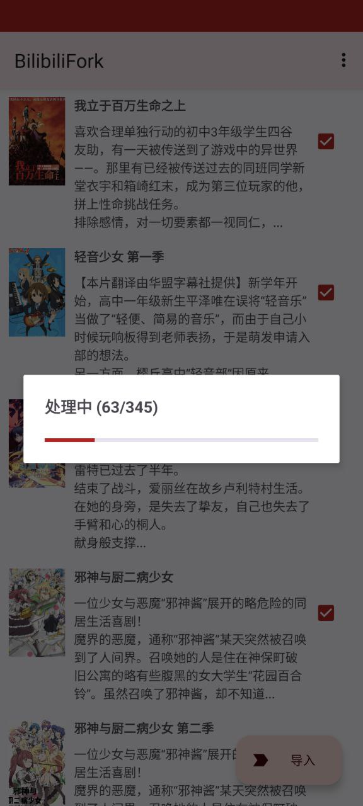

# BilibiliFork

一款用于将他人的番剧列表导入自己的帐号的小工具

# 起因

由于我本身有两个B站帐号，在开大会员的时候（我也不想给叔叔送钱，就是用来看老番的）不小心开到另一个不常用的帐号去了，两个帐号的追番列表不一样，三百多个追番一个一个点太累了（话说写这玩意貌似更累），所以就写了一款快捷导入的工具。

# 怎么用

+ 右上角菜单打开`UID与Cookie`菜单
+ 找到导入源帐号的`UID`，然后复制粘贴到`UID`的输入框当中
+ 到浏览器登陆你的帐号，然后打开元素审查，找到域名为`https://api.bilibili.com`的请求，然后复制`Request`请求头中`Cookie`的内容，格式一般是`buvid3=...; _uuid=...;bili_jct`。复制后粘贴到`Cookie`输入框中
+ 点击确定
+ 下拉刷新番剧列表
+ 勾选需要导入的番剧
+ 点击导入，等待完成即可

# 提示

+ 如果要导入别人的追番列表，那别人的追番列表至少要是公开的
+ 如果提示`错误：xxx`，我也不知道什么问题，再试试
+ 有什么问题可以重试几次看看，因为我也没碰到过什么问题

# 示例

|  |  |  |
| -- | -- | -- |